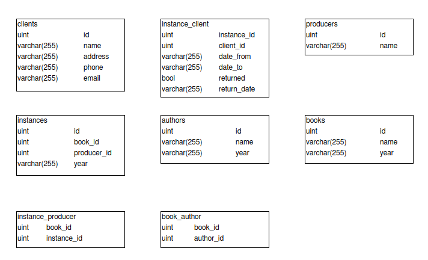

# lms
База данных для библиотеки

Требования:
Язык программирования - Golang
СУБД - PostgreSQL

[Дамп базы данных](https://github.com/TretyakovArtem/lms/blob/master/dump-library-202004020334.sql)

## Схема базы данных

